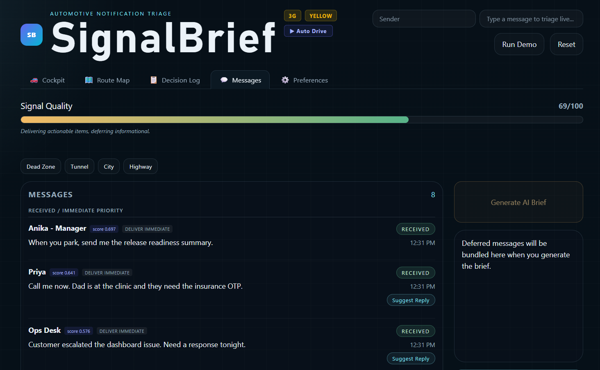

# SignalBrief — Automotive Notification Triage System

> **An AI-powered, context-aware notification triage engine for in-vehicle use**, built as a full-stack local system with a real-time HMI dashboard, a 5-component triage score, ML-based urgency classification, geo-zone routing, and persistent user preferences.

---

---

## Table of Contents

1. [What It Does](#what-it-does)
2. [System Architecture](#system-architecture)
3. [AI & ML Pipeline](#ai--ml-pipeline)
4. [Triage Score Formula](#triage-score-formula)
5. [Hard Override Rules](#hard-override-rules)
6. [Backend Deep Dive](#backend-deep-dive)
7. [Frontend HMI Dashboard](#frontend-hmi-dashboard)
8. [Vehicle Context & Route Simulation](#vehicle-context--route-simulation)
9. [Personalization & Preferences](#personalization--preferences)
10. [Re-Triage Engine](#re-triage-engine)
11. [Data Flow: End to End](#data-flow-end-to-end)
12. [Running Locally](#running-locally)
13. [Environment Variables](#environment-variables)
14. [API Reference](#api-reference)
15. [Project Structure](#project-structure)

---

## What It Does

SignalBrief is an **in-vehicle notification intelligence layer**. When you're driving, your phone receives dozens of messages — WhatsApp, email, Slack, SMS. Most of these shouldn't interrupt you while you're navigating a busy road.

SignalBrief ingests every incoming message and runs it through a multi-stage decision pipeline:

1. **Classify urgency** using a trained ML model (or an LLM API)
2. **Score the message** with a 5-component weighted formula
3. **Apply hard rules** for safety-critical scenarios (DND, driving, no signal)
4. **Deliver, defer, or hold** the message based on context
5. **Flush the queue** when the vehicle enters a good signal zone

The entire decision is **explainable** — every message shows its score breakdown, rule that fired, and why it was held or delivered.

---

## System Architecture

```
┌─────────────────────────────────────────────────────────────────┐
│                         FRONTEND (Vite + React + TypeScript)    │
│                                                                 │
│  ┌──────────┐  ┌──────────┐  ┌──────────────┐  ┌───────────┐  │
│  │ Cockpit  │  │Route Map │  │ Decision Log │  │Preferences│  │
│  │   HMI   │  │  (SVG)   │  │  (Audit Log) │  │  Panel   │  │
│  └──────────┘  └──────────┘  └──────────────┘  └───────────┘  │
└───────────────────────────────┬─────────────────────────────────┘
                                │  HTTP REST (polling ~3s)
                                ▼
┌─────────────────────────────────────────────────────────────────┐
│                        BACKEND (FastAPI + Python)               │
│                                                                 │
│  ┌─────────────┐   ┌─────────────┐   ┌──────────────────────┐  │
│  │ AI Service  │   │ Rule Engine │   │ Personalization Mgr  │  │
│  │(TF-IDF+LR  │──▶│ (5-formula) │──▶│ (prefs.json + hist.) │  │
│  │ or Sarvam) │   │ + Overrides │   └──────────────────────┘  │
│  └─────────────┘   └──────┬──────┘                             │
│                           │                                     │
│  ┌─────────────┐   ┌──────▼──────┐   ┌──────────────────────┐  │
│  │ Context Eng │   │ Deferred Q  │   │   Geo Zone Tracker   │  │
│  │(18 waypoints│   │ (holds msgs)│◀──│ (GREEN/YELLOW/RED/   │  │
│  │  Bangalore) │──▶│             │   │  DEAD zones)         │  │
│  └─────────────┘   └─────────────┘   └──────────────────────┘  │
└─────────────────────────────────────────────────────────────────┘
                                │
                    ┌───────────▼──────────┐
                    │  File Persistence    │
                    │  prefs.json          │
                    │  pref_history.json   │
                    │  models/urgency_*    │
                    └──────────────────────┘
```

---

## AI & ML Pipeline

Every incoming message is classified by the **AI Service** (`backend/ai_service.py`), which runs in two modes:

### Mode 1 — Local ML Model (default, no API key needed)

```
Raw message text
      │
      ▼
TF-IDF Vectoriser   (sklearn, ~3000 features)
      │
      ▼
Logistic Regression  (trained on urgency_dataset.csv)
      │
      ▼
urgency_score ∈ [0, 1]   (confidence of urgency)
priority ∈ {urgent, actionable, informational, ignore}
```

**Training data** (`data/urgency_dataset.csv`): ~500+ curated message samples with labels. The model is trained on startup if `models/urgency_model.pkl` doesn't exist. Training takes < 5 seconds on CPU.

**Key insight:** The ML model outputs a *raw urgency signal*. This is only **40% of the final decision** — the remaining 60% comes from contextual factors the model has no access to (sender trust, signal quality, driving state, time of day).

### Mode 2 — Sarvam AI (LLM, optional)

If `SARVAM_API_KEY` is set in `.env`, the system sends the message to Sarvam's language model for classification. This gives richer semantic understanding for ambiguous messages ("can we talk?" vs "can we talk now it's urgent").

```
Message text
      │
      ▼
POST /v1/classify   (Sarvam AI API)
      │
      ▼
priority + urgency_score
```

Falls back to the local ML model automatically if the API call fails or times out.

---

## Triage Score Formula

**Protocol Section 1** — The core formula that produces a single score ∈ [0, 1]:

```
score = urgency  × 0.40
      + sender   × 0.25
      + signal   × 0.15
      + context  × 0.10
      + keyword  × 0.10
```

| Component | Weight | What it measures |
|---|---|---|
| **Urgency** | 40% | ML model confidence score (0–1) |
| **Sender** | 25% | `(sender_tier / 4) × user_weight` — who sent it |
| **Signal** | 15% | Current network signal quality (0–1) |
| **Context** | 10% | In-coverage-zone (+0.25), work hours (+0.15), driving (−0.20) |
| **Keyword** | 10% | Hard urgency keywords in text ("urgent", "SOS", "emergency" etc.) |

### Example: "Your friend sachin is lost" from Abhay

```
urgency  = 0.55 × 0.40 = 0.22   ← ML says moderately urgent
sender   = (1/4 × 0.5) × 0.25 = 0.03  ← Abhay: tier 1 peer, default weight
signal   = 0.67 × 0.15 = 0.10   ← YELLOW zone
context  = 0.55 × 0.10 = 0.05   ← driving, partial penalty
keyword  = 0    × 0.10 = 0.00   ← "lost" not in hard keyword list
──────────────────────────────────
score    = 0.339   →  HOLD FOR DIGEST (below 0.45 defer threshold)
```

> **This is the "HIGH but held" case** — the ML classifies it as urgent (HIGH badge was removed) but the automotive triage score is low because Abhay is an untrusted peer in a weak-signal zone. The car correctly holds it.

### What changes when you whitelist Abhay?

```
sender_tier = 4  (whitelist = tier 4)
→ Rule 1 fires: WHITELIST_OVERRIDE → immediate delivery
→ Score is irrelevant, rule bypasses the formula entirely
```

---

## Hard Override Rules

**Protocol Section 4** — Applied **after** the score, in strict priority order. The first matching rule wins and the score is ignored.

```
Rule 1  Sender is whitelisted          → WHITELIST_OVERRIDE    (always deliver)
Rule 2  urgency_score ≥ 0.85           → DELIVER_IMMEDIATE     (bypass all)
Rule 3  DND window active              → HOLD_FOR_DIGEST       (hold non-whitelist)
Rule 4  Driving + urgency ≥ 0.60       → DELIVER_AUDIO_ONLY    (no visual)
Rule 5  No signal (offline)            → FALLBACK_VIBRATE      (urgent only)
        No signal + low urgency        → HOLD_FOR_DIGEST       (wait for signal)
```

### Tail-End (score gating, after all rules pass)

```
score ≥ deliver_threshold (default 0.65)  →  DELIVER_IMMEDIATE
score ≥ defer_threshold   (default 0.45)  →  DEFER_TO_ZONE
score < defer_threshold                   →  HOLD_FOR_DIGEST
```

Both thresholds are **user-configurable** in the Preferences panel and saved persistently.

---

## Backend Deep Dive

### `ai_service.py` — Urgency Classification
- Loads `models/urgency_model.pkl` (TF-IDF + LogisticRegression)
- Trains and saves the model on first run from `data/urgency_dataset.csv`
- Optional Sarvam AI API integration with fallback
- Returns: `priority`, `urgency_score`, `reply_suggestion`, `audio_summary`

### `rule_engine.py` — Triage Decision
- `compute_triage_score(features)` — the 5-component weighted formula
- `apply_triage_rules(features, prefs)` — all 5 override rules + tail-end
- `DecisionLogEntry` — full audit record stored for every decision
- Returns: `TriageResult` with action, reason, override flag, log entry

### `personalization.py` — User Preferences
- Singleton `PreferencesManager` shared across all modules
- **File-backed persistence** — writes `prefs.json` on every change
- **Change log** — appends to `pref_history.json` with human-readable summaries
- Exposes: `is_whitelisted()`, `get_sender_tier()`, `get_sender_weight()`, `is_in_dnd()`
- Sender tier auto-upgrade: weight ≥ 0.85 → tier 3 (boss-level priority)

### `context_engine.py` — Vehicle State
- 18-waypoint Bangalore route simulation (Koramangala → Whitefield)
- Each waypoint has: lat/lon, speed, signal quality, zone colour, network type
- `step()` advances one waypoint, returns `VehicleContextState`
- Work hours detection, driving mode detection, route progress %

### `geo_zones.py` — Zone Tracking
- Zones: `GREEN` (full delivery), `YELLOW` (partial), `RED` (urgent only), `DEAD` (offline)
- Fires callbacks on zone transitions
- Zone recovery → auto-flushes the deferred queue

### `message_queue.py` — Deferred Queue
- Holds messages when zone is RED/DEAD or DND is active
- `flush()` — sorts by triage_score, delivers top N immediately, bundles rest as digest
- `flush_critical_only()` — for RED zone recovery, only urgency ≥ 0.75

### `controller.py` — Orchestration
- The main `SignalBriefController` wires all components together
- `ingest_message()` — full pipeline: classify → feature-vector → score → rule → store
- `retriage_deferred_queue()` — re-evaluates held messages with updated prefs
- `preview_retriage_impact()` — dry-run: counts promotable messages without changing state

---

## Frontend HMI Dashboard

Built with **React + TypeScript + Vite**, served on `http://localhost:5173`.

### Tab 1 — Cockpit 🚗
The primary driver view:

| Widget | What it shows |
|---|---|
| **SVG Speedometer** | Current simulated speed in km/h, DRIVING label |
| **Signal Bars** | Network signal quality + latency in ms |
| **Queue Counter** | Messages being held + urgent count highlight |
| **Route Ring** | Circular progress of Bangalore route (0–100%) |
| **Live Triage Gate Bar** | Visual hold/digest/deliver zones from current Preferences thresholds |
| **Hold Reason Banner** | Appears when DND active, RED zone, or DEAD zone — explains why messages are held |
| **Zone Status Bar** | Current geo-zone colour + location label + DND chip |

### Tab 2 — Route Map 🗺️
- SVG-rendered Bangalore route (lat/lon projected to canvas)
- Zone-coloured road segments (GREEN/YELLOW/RED/DEAD)
- Animated vehicle position dot
- All 18 waypoints labelled

### Tab 3 — Decision Log 📋
Full audit table of every triage decision:
- Urgency score, sender tier, triage score in sortable columns
- Action chip colour-coded (WHITELIST_OVERRIDE = gold, DELIVER = green, HOLD = grey)
- Override indicator distinguishes rule-fired decisions from score-gated ones
- Refresh button + auto-refresh on auto-drive

### Tab 4 — Messages 💬
- All non-ignored messages, newest first
- Each card: sender, triage score, triage action, message text, timestamp
- **Suggest Reply** — AI generates a context-aware reply suggestion
- **Voice Read** — TTS audio summary of message
- Signal quality strip + active rule text

### Tab 5 — Preferences ⚙️
The settings panel that drives the triage engine:

| Card | Controls |
|---|---|
| **Triage Score Thresholds** | Defer/Deliver sliders with a live visual track |
| **Sender Priority Weights** | Per-sender weights 0–1, add/remove, auto-tier upgrade |
| **Whitelist** | Tag-based add/remove — whitelisted senders always deliver |
| **DND Window** | Start/end hour for Do Not Disturb + driving speed threshold |

**On Save & Apply:**
1. Preferences saved to `prefs.json`
2. `POST /api/preferences/retriage` runs instantly — promotes any held messages that now pass new rules
3. Retriage result banner shows exactly which messages were promoted and why
4. Impact preview badge shows `⚡ X / Y in queue would unlock` before you even save

---

## Vehicle Context & Route Simulation

The 18-waypoint Bangalore route simulates real-world driving conditions:

```
Koramangala 6th Block  →  Silk Board Exit       [GREEN,  45 km/h, 4G]
Silk Board Exit        →  Electronic City Flyover [YELLOW, 35 km/h, 3G]
Electronic City Flyover→  Bommanahalli Underpass  [RED,    20 km/h, 2G]
Bommanahalli Underpass →  BTM Layout              [DEAD,    5 km/h, NO SIG]
...continues across 18 stops to Whitefield...
```

Each step:
- Updates `VehicleContextState` (speed, signal, zone, network, latency)
- Fires `GeoZoneTracker` which checks for zone transitions
- Zone `RED → GREEN` recovery auto-flushes the deferred queue
- **Auto-Drive mode** steps the route every 2.5 seconds automatically

---

## Personalization & Preferences

```
User changes            File persistence        Runtime effect
──────────────          ────────────────        ──────────────
Whitelist "Abhay"  ──▶  prefs.json updated ──▶  next message from Abhay
                         pref_history.json        → WHITELIST_OVERRIDE
                         entry logged

Defer threshold    ──▶  prefs.json updated ──▶  tail-end gating uses
0.45 → 0.35              + history entry          new threshold instantly

Save & Apply       ──▶  retriage runs on  ──▶  Abhay's held messages
                         all held messages        promoted to delivered
                                                  (shown in banner)
```

### Sender Tier System

| Tier | Who | How assigned |
|---|---|---|
| Tier 4 | Whitelisted senders | Explicit whitelist in Preferences |
| Tier 3 | Boss / Manager level | Pattern match on name OR weight ≥ 0.85 |
| Tier 2 | Family | Mom, Dad, Wife, Husband, etc. (pattern match) |
| Tier 1 | Default peer | Everyone else |

Tier affects the **Sender component** of the triage score: `(tier / 4) × user_weight`.

---

## Re-Triage Engine

A key innovation in SignalBrief: **preferences are not just for future messages** — they retroactively apply to the existing deferred queue.

### How it works

```
User saves preferences (e.g. whitelist "Abhay")
          │
          ▼
POST /api/preferences/retriage
          │
          ▼
For each held message in _messages (status = deferred/received):
  1. Rebuild MessageFeatureVector with current prefs
     - new sender_tier (Abhay is now tier 4)
     - new user_weight
     - same urgency_score (ML result unchanged)
  2. Recompute triage_score
  3. Re-apply all 5 override rules
  4. If now WHITELIST_OVERRIDE / DELIVER_IMMEDIATE:
     - msg.status = "delivered"
     - Remove from deferred queue
     - Log decision to audit trail
          │
          ▼
Return: { promoted_count, promoted: [{sender, preview, reason}], still_held }
```

### Preview (dry-run)
`GET /api/preferences/retriage/preview` counts promotable messages **without changing state** — used to populate the `⚡ X / Y in queue would unlock` badge in the Preferences header.

---

## Data Flow: End to End

```
User sends "Your friend sachin is lost" (from Abhay)
                      │
                      ▼
          POST /api/ingest_message
                      │
            ┌─────────────────────┐
            │   ai_service.py     │
            │                     │
            │  TF-IDF → LogReg    │
            │  → urgency_score    │
            │    = 0.55           │
            │  → priority         │
            │    = "urgent"       │
            └────────┬────────────┘
                     │
            ┌────────▼────────────┐
            │  rule_engine.py     │
            │                     │
            │  Build feature vec: │
            │  urgency = 0.55     │
            │  tier    = 1        │
            │  weight  = 0.5      │
            │  signal  = 0.67     │
            │  driving = True     │
            │                     │
            │  score = 0.339      │
            │                     │
            │  Rule 1? Not WL     │
            │  Rule 2? < 0.85     │
            │  Rule 3? Not DND    │
            │  Rule 4? driving    │
            │   + urgency < 0.60  │ ← just misses audio-only
            │  Rule 5? Has signal │
            │                     │
            │  Tail-end:          │
            │  0.339 < 0.45       │
            │  → HOLD_FOR_DIGEST  │
            └────────┬────────────┘
                     │
            ┌────────▼────────────┐
            │  controller.py      │
            │                     │
            │  msg.status =       │
            │  "deferred"         │
            │  deferred_queue     │
            │  .enqueue(msg)      │
            └────────┬────────────┘
                     │
                     ▼
            Message stays in queue until:
            a) Zone recovers GREEN → auto-flush
            b) User flushes manually
            c) User whitelists Abhay → retriage → promote
```

---

## Running Locally

### Prerequisites
- Python 3.11+
- Node.js 18+

### 1. Start the Backend

```powershell
# From project root
.\venv\Scripts\activate

# Install deps (first time only)
pip install fastapi uvicorn pydantic httpx groq scikit-learn

# Start server
uvicorn backend.main:app --reload --port 8000
```

Or use the included batch file:
```powershell
.\start_backend.bat
```

The backend starts at `http://127.0.0.1:8000`.

### 2. Train the Urgency Model (first time only)

```powershell
.\venv\Scripts\python scripts\train_urgency_model.py
```

This trains a TF-IDF + Logistic Regression model on `data/urgency_dataset.csv` and saves it to `models/urgency_model.pkl`. Runtime: ~3–5 seconds.

The backend also auto-trains on startup if no model file exists.

### 3. Start the Frontend

```powershell
.\start_frontend.bat
# or
cd frontend && npm install && npm run dev
```

Frontend available at `http://localhost:5173`.

### 4. Run the Demo

1. Open the browser at `http://localhost:5173`
2. Click **Run Demo** to start the Bangalore route scenario
3. Use **▶ Auto Drive** to automatically step through the route every 2.5s
4. Watch messages triage in real-time as zones change
5. Add a sender to the **Whitelist** in Preferences → click **Save & Apply** → see held messages instantly promoted

---

## Environment Variables

Create a `.env` file in the project root (see `.env_example`):

```env
# Optional — enables LLM-based classification via Sarvam AI
SARVAM_API_KEY=your_sarvam_api_key_here

# Optional — enables TTS audio summaries
TTS_ENABLED=true

# Backend URL (for frontend, if deploying remotely)
VITE_API_ROOT=http://127.0.0.1:8000
```

If no `SARVAM_API_KEY` is set, the system uses the local ML model exclusively.

---

## API Reference

### State & Messages

| Endpoint | Method | Description |
|---|---|---|
| `/api/state` | GET | Full app snapshot: messages, context, queue, runtime |
| `/api/ingest` | POST | Ingest a new message through the full triage pipeline |
| `/api/reset` | POST | Reset all messages and simulation state |

### Vehicle & Route

| Endpoint | Method | Description |
|---|---|---|
| `/api/vehicle/context` | GET | Current VehicleContextState: speed, zone, signal, etc. |
| `/api/route` | GET | All 18 Bangalore waypoints for route map |
| `/api/simulate/step` | POST | Advance route by one waypoint |

### Queue

| Endpoint | Method | Description |
|---|---|---|
| `/api/queue` | GET | Deferred queue state: stats, items, zone history |
| `/api/queue/flush` | POST | Manually flush the entire deferred queue |

### Decisions & AI

| Endpoint | Method | Description |
|---|---|---|
| `/api/decisions/log` | GET | Triage audit log (newest first, `?limit=N`) |
| `/api/reply` | POST | Generate AI reply suggestion for a message |
| `/api/digest` | POST | Generate AI digest of held messages |
| `/api/tts` | POST | Text-to-speech audio for a message |

### Preferences

| Endpoint | Method | Description |
|---|---|---|
| `/api/preferences` | GET | Current preferences + live DND status |
| `/api/preferences` | POST | Save preferences (persisted to `prefs.json`) |
| `/api/preferences/reset` | POST | Reset to protocol defaults |
| `/api/preferences/retriage` | POST | Re-evaluate deferred queue with current prefs |
| `/api/preferences/retriage/preview` | GET | Dry-run: count promotable messages |
| `/api/preferences/history` | GET | Change changelog (newest first) |

### Scenario

| Endpoint | Method | Description |
|---|---|---|
| `/api/scenario/start` | POST | Start the Bangalore drive demo scenario |
| `/api/scenario/stop` | POST | Stop the scenario |

---

## Project Structure

```
SignalBrief/
│
├── backend/                    Python FastAPI backend
│   ├── main.py                 API endpoints and app factory
│   ├── controller.py           Orchestration: ingest, snapshot, retriage
│   ├── ai_service.py           ML model + Sarvam AI classification
│   ├── rule_engine.py          5-component score + 5 override rules
│   ├── personalization.py      User prefs, sender tiers, DND logic
│   ├── context_engine.py       18-waypoint Bangalore route simulation
│   ├── geo_zones.py            Zone tracker + flush callbacks
│   ├── message_queue.py        Deferred queue with smart flush
│   ├── domain.py               Core dataclasses (Message, FeatureVector, etc.)
│   ├── scenario.py             Demo scenario builder
│   ├── prefs.json              ← runtime: persisted preferences
│   └── pref_history.json       ← runtime: preference change changelog
│
├── frontend/                   React + TypeScript + Vite HMI
│   └── src/
│       ├── App.tsx             Main app: tabs, polling, state management
│       ├── HMIDisplay.tsx      Cockpit tab: speedometer, signal, queue ring
│       ├── GeoRouteMap.tsx     Route Map tab: SVG Bangalore route
│       ├── DecisionLog.tsx     Decision Log tab: audit table
│       ├── PreferencesPanel.tsx Preferences: sliders, whitelist, history
│       ├── types.ts            TypeScript types for all API responses
│       └── styles.css          Automotive dark theme design system
│
├── data/
│   └── urgency_dataset.csv     ML training data: 500+ labelled messages
│
├── models/
│   ├── urgency_model.pkl       ← runtime: trained LogReg model
│   └── tfidf_vectorizer.pkl    ← runtime: fitted TF-IDF vectorizer
│
├── scripts/
│   ├── train_urgency_model.py  Standalone model training script
│   └── export_onnx.py          Export model to ONNX for edge deployment
│
├── start_backend.bat           Windows: start uvicorn
├── start_frontend.bat          Windows: start Vite dev server
├── pyproject.toml              Python project metadata
└── .env_example                Environment variable template
```

---

## Design Decisions

### Why local ML instead of calling an LLM for every message?

Latency. A car moving at 60 km/h can't wait 2–3 seconds for an API call before deciding whether a message is urgent. The TF-IDF + Logistic Regression model runs in **< 5ms** on CPU. The Sarvam AI integration exists for richer classification in connected scenarios but is never on the critical path.

### Why a weighted formula instead of just using the ML score?

The ML model only sees text. It can't know:
- That the sender is your mother (high trust) vs a newsletter (low trust)
- That you're doing 80 km/h on a highway (delivery risk)
- That signal just dropped to 2G (network constraint)
- That it's 3 AM (DND window)

The 5-component formula fuses all these signals into one automotive-safe decision.

### Why SVG for the route map and gauges?

No external dependencies. The HMI runs entirely self-contained — no Mapbox, no Google Maps, no CDN. This is important for in-vehicle systems where connectivity may be intermittent and bundle size matters.

### Why file-based preference storage instead of a database?

The system is designed as a **local-first** application. A SQLite or Postgres setup would add setup friction. JSON files are human-readable, debuggable, and survive process restarts — exactly what's needed for a personal preference store on a single device.

---

## Protocol Reference

The full triage protocol is documented in `SignalBrief_Rebuilt_Protocol.md` in the project root. Key sections:

- **Section 1** — Triage Score Formula and component weights
- **Section 2** — Feature Vector specification (10 features)
- **Section 3** — Deferred Queue and flush strategy
- **Section 4** — Hard Override Rules (5 rules + tail-end)
- **Section 5** — Personalization layer: tiers, weights, DND

---

*Built with FastAPI, React, scikit-learn, and a lot of careful thought about what should and shouldn't interrupt a driver.*